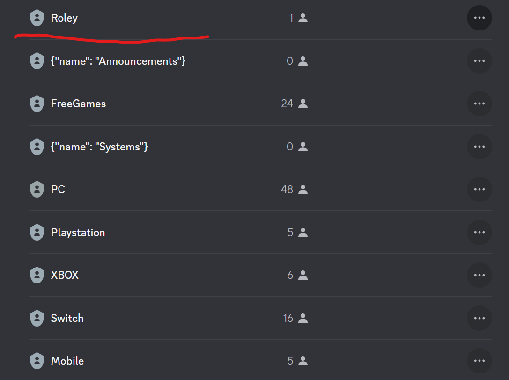
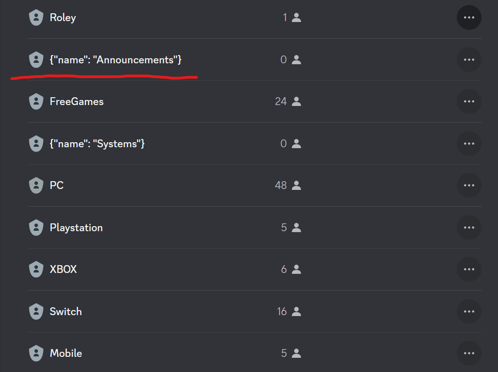
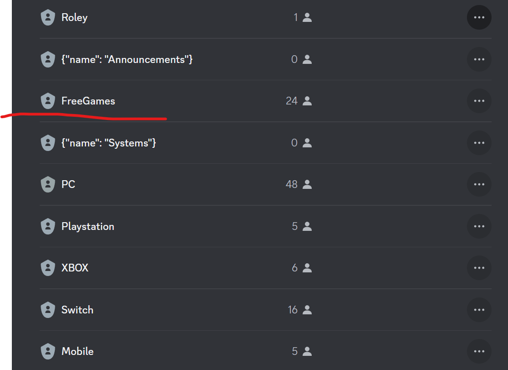

# Roley

Another bot that manages discord roles.

For our discord we have a lot of roles you can sign up for when other people are interested in looking for players for a certain game. Most reaction bots don't handle the number of roles, or you need to configure everything manually.

I wanted something a little easier to manage and select things with.

## tl;dr

* Deploy your own via - 
* [Use deployed version](https://discord.com/api/oauth2/authorize?client_id=1172621787041890374&permissions=268435456&scope=bot%20applications.commands)

## How to use

1) Make sure newly created bot role is above any roles you want to manage.

2) Create a new role above roles for a category. It should be JSON with a name field. Eg: `{"name": "Announcements"}`

3) Put any roles you want managed under that category

4) Run /roles in your discord

5) ????
6) Profit

# License

MIT License

# Issues?

Feel free to create a github issue, I won't make any promises about getting to it, but likely it'll affect me too.